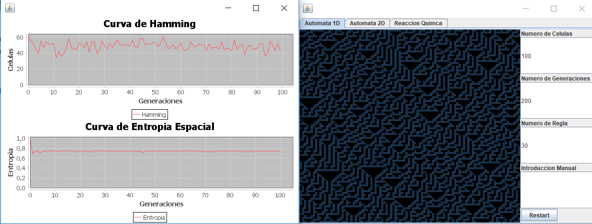
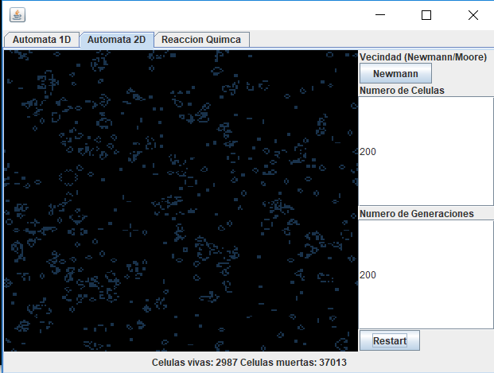
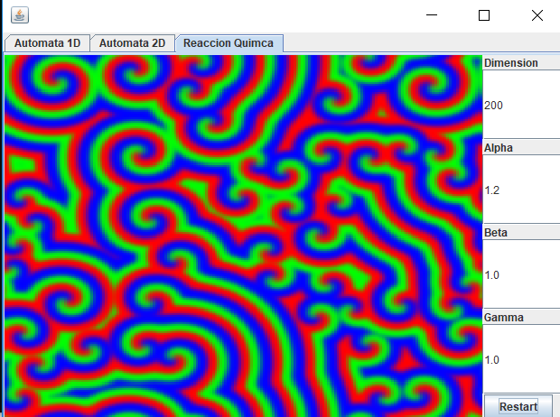
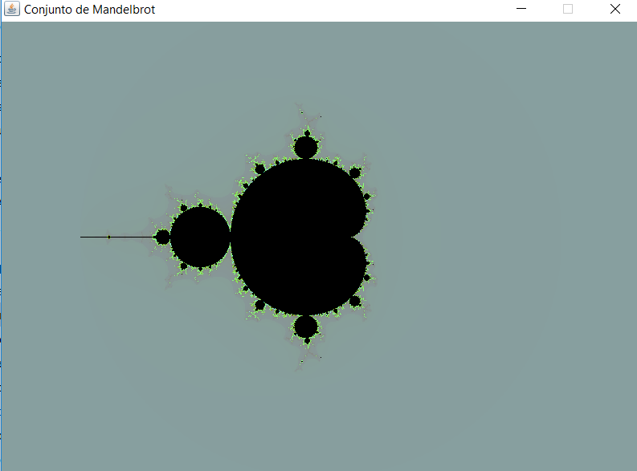
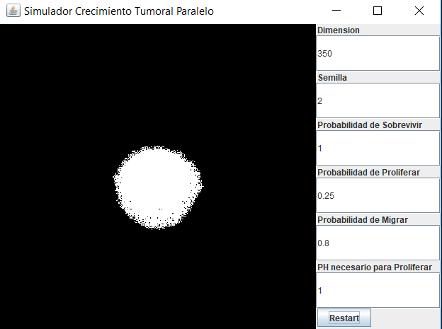

**All of them are programmed concurrently.**

# Automaton
This is a GUI which shows the representation of an automaton 1D, 2D and a chemical reaction.

To execute this GUI, open *ejecutable.bat*.

## Automaton 1D
You can change the rule you want the automaton to represent, the size and the number of generations.



Rules: http://mathworld.wolfram.com/ElementaryCellularAutomaton.html

## Automaton 2D
This automaton represents [Conway's Game Life](https://en.wikipedia.org/wiki/Conway%27s_Game_of_Life).

It allows you to change the size, the number of generations and the type of neighborhood



## Chemical Reaction
It shows graphically the [Belusov-Zhabotinsky's Chemical Reaction](https://en.wikipedia.org/wiki/Belousov%E2%80%93Zhabotinsky_reaction).

You can change the size and the parameters of the reaction.



# MandelBrot Set
[Link to MandelBrot set](https://en.wikipedia.org/wiki/Mandelbrot_set).

To execute the program, enter these commands in the terminal (situated in MandelBrot Set's folder):

```
javac MandelBrot.java
java MandelBrot
```

.

# Tumor Growth
It represents a tumor growth that depends on different parameters. It is based on this article: http://www.urop.uci.edu/journal/journal09/06_phan.pdf.

You can change the probability of cell survival, probability of cell migration, probability of cell proliferation, PH, the size and the initial number of dead cells.

To execute the program, enter these commands in the terminal (situated in Tumor Growth's folder):

```
javac parallelTumoralGrowth.java
javac parallelTumorGraphic.java
java parallelTumoralGrowth
```


